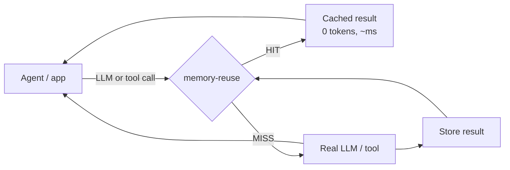
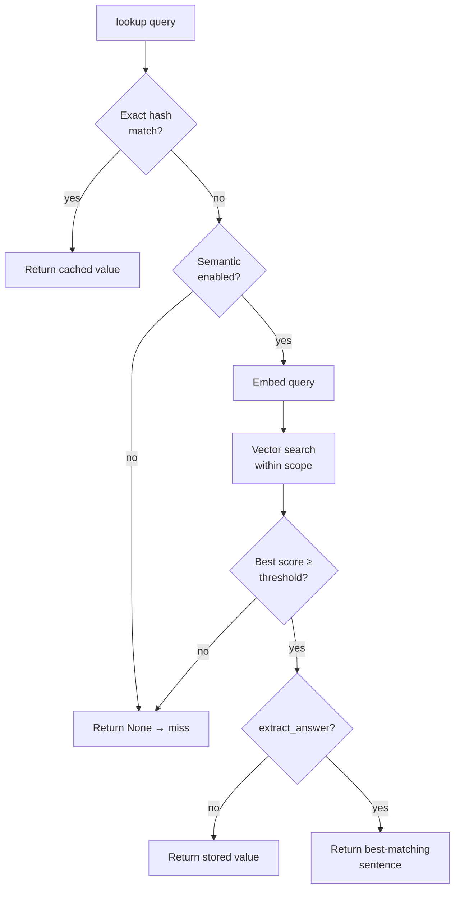
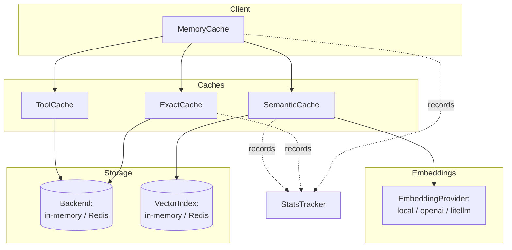
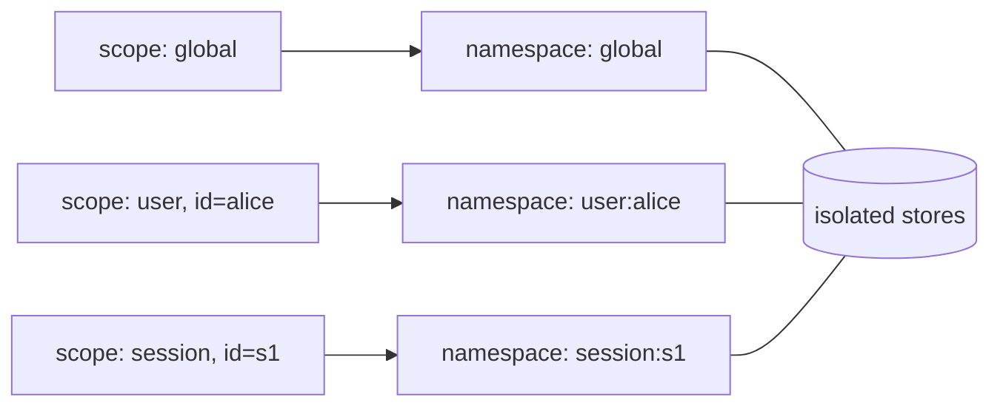

# Architecture

This page explains **what memory-reuse does**, **how it's built**, **where you'd
use it**, and **how the pieces fit together**.

## What problem it solves

AI agents repeat work constantly — the same prompt, the same tool call, the same
question phrased slightly differently. Each repeat costs tokens, money, and
latency. memory-reuse sits between your agent and the expensive call and returns
a stored result whenever it safely can.



## The two-layer lookup

A lookup always tries the **exact cache first** (a hash match — fast and free).
Only on an exact miss, and only if semantic caching is enabled, does it embed
the query and look for a *similar* previous request. An exact hit never computes
an embedding, so identical repeats stay as cheap as a plain cache.



## Component architecture

`MemoryCache` is the front door. It wires together a storage backend, the exact
and tool caches, and — when enabled — the semantic cache (an embedding provider
plus a vector index). Everything shares one stats tracker.



Each layer is swappable behind an interface:

- **Backend** (`AbstractBackend`) — `InMemoryBackend` or `RedisBackend`.
- **VectorIndex** — `InMemoryVectorIndex` (brute-force cosine) or
  `RedisVectorIndex` (Redis Stack KNN with an in-process fallback).
- **EmbeddingProvider** — `LocalEmbedder`, `OpenAIEmbedder`, or `LiteLLMEmbedder`,
  all lazily importing their heavy dependency only when selected.

## Scope isolation

Every entry lives in a **namespace** derived from its scope, so one user's
cached data is never served to another. The same rule applies to both the exact
and semantic caches.



## Where you can use it

memory-reuse is framework-agnostic — anywhere you make repeatable LLM or tool
calls:

| Use case | What to cache | Scope | Semantic? |
|---|---|---|---|
| Chatbot / FAQ agent | LLM answers to user questions | `user` or `session` | Yes — reworded questions repeat |
| RAG / docs Q&A | answers to knowledge queries | `global` | Yes |
| Tool calls (search, weather, DB reads) | tool return values | `global` or `user` | Usually no — depends on exact args |
| Deterministic tools (math, formatting) | computed results | `global` | No — `exact_only` |
| Embedding pipelines | embedding vectors | `global` | No (cache the embedding call itself) |
| Multi-user SaaS agent | per-user answers | `user` | Optional |

Rule of thumb: **semantic caching for natural-language questions**, **exact
caching for commands and anything correctness-critical** (see
[Semantic cache → Choosing where to use it](semantic-cache.md#choosing-where-to-use-semantic-matching)).

## How to use it — at a glance

=== "Decorator (simplest)"
    ```python
    from memory_reuse import MemoryCache
    from memory_reuse.integrations import cached_tool

    cache = MemoryCache()

    @cached_tool(cache, scope="global", ttl=300)
    async def search_web(query: str) -> list[str]:
        return await my_search_api(query)   # only runs on a miss
    ```

=== "Manual exact cache"
    ```python
    result = await cache.exact.get(["gpt-4", prompt], scope="global", scope_id=None)
    if result is None:
        result = await llm.ainvoke(prompt)
        await cache.exact.set(["gpt-4", prompt], result, scope="global",
                              scope_id=None, ttl=3600)
    ```

=== "Combined exact + semantic"
    ```python
    from memory_reuse import MemoryCache, CacheConfig

    cache = MemoryCache(CacheConfig(
        semantic_enabled=True,
        embedding_provider="local",
    ))

    answer = await cache.lookup(key_parts, query_text=question,
                                scope="user", scope_id="alice")
    if answer is None:
        answer = await run_agent(question)
        await cache.store(key_parts, query_text=question, value=answer,
                          scope="user", scope_id="alice")
    ```

For deeper guides see [Quick start](quickstart.md),
[Usage patterns](usage.md), and the [Semantic cache](semantic-cache.md).
